/badge.svg?branch=master)

# Open Data Service (ODS)

The Open Data Service (ODS) is an application which can collect data from multiple sources simulataneously, process that data and then offer an improved (or "cleaned") version to its clients.
*We aim to establish the ODS as **the** go-to place for using Open Data!*

# Quick Start
To execute the ODS locally, run `docker-compose up` in the project root directory. The ui will be accessible under `localhost:9000`.  

# Table of Contents
- [Open Data Service (ODS)](#open-data-service-ods)
- [Quick Start](#quick-start)
- [Table of Contents](#table-of-contents)
- [Configure the ODS](#configure-the-ods)
  - [Using the API](#using-the-api)
  - [Using the UI](#using-the-ui)
- [Project Structure](#project-structure)
- [Deployment](#deployment)
- [Contributing](#contributing)
- [Contact us](#contact-us)
- [License](#license)

# Configure the ODS 
In order to fetch and transform data from an external source, the ODS needs to be configured.
The configuration consists of two steps: 
* A Data Source needs to be configured, i.e. URI, protocol, data format has to be specified as well as a trigger.
* For each Data Source, one or more Pipelines can be configured to further process the data and possibly trigger a notification. 
  
This configuration can be done programmatically via the API or browser based with a gui.

## Using the API
There is a collection of examples for entire configurations in our [example request collection](doc/example-requests/).

Additionally, there is is swagger API documentation available under `localhost:9400`. 
The swagger integration is currently in progress, so there is only documentation for the storage service available.

## Using the UI

The easiest way to use the ODS is via the UI. If you started the ODS with docker-compose you can access the UI under `http://localhost:9000/`.

To demonstrate the ODS we will create a new pipeline to fetch water level data for German rivers and have a look at the collected data.

First, go to the Datasources page and click on `Create new Datasource`. 
The configuration workflow for creating a new Datasource is divided into the following four steps.

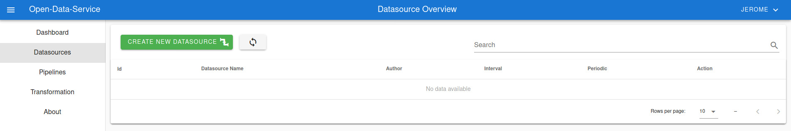

Step 1: Name the datasource.

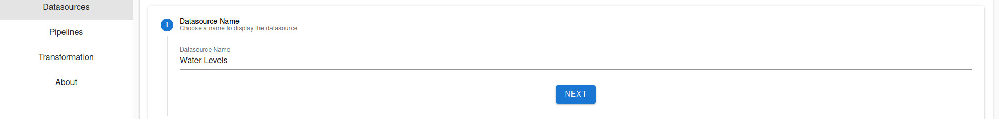

Step 2: Configure an adapter to crawl the data. You can use the prefilled example settings.

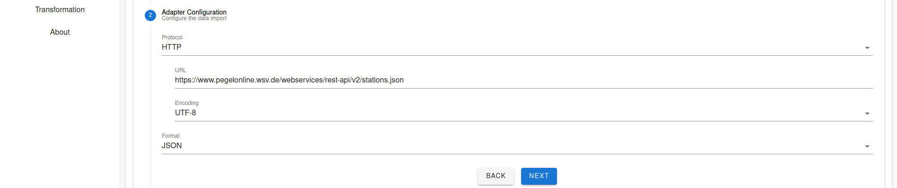

Step 3: Describe additional meta-data for the data source.

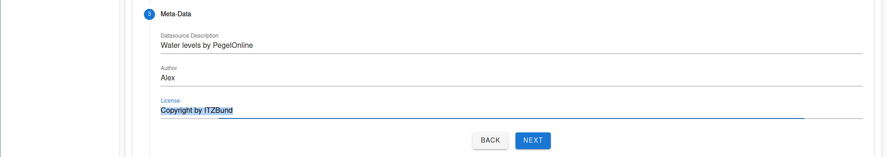

Step 4: Configure the interval of how often the data should be fetched.
If `Periodic execution` is disabled the data will be fetched only once.
With the two sliders, you can choose the interval duration.
The first execution of the pipeline will be after the `Time of First Execution` plus the interval time.
Please choose 1 minute, so that you don't have to wait too long for the first data to arrive.

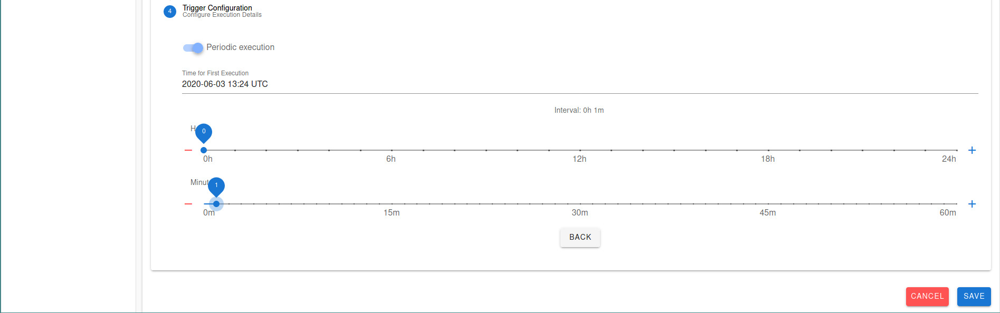

The configuration of the data source is now finished. In the overview, you see the recently created data source.
Rembember the id on the left to the Datasource name, we will need it in the next step.
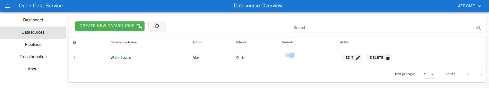

To obtain the data fetched by this data source, you need to create a pipeline operating on the data source we just created.
Go to the Pipelines page and click on `Create new Pipeline`. The creation process consists of three steps.
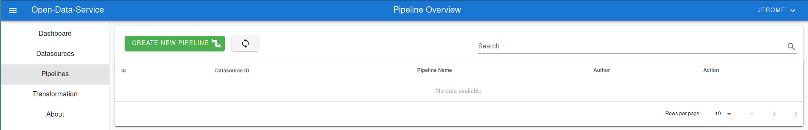

Step 1: Choose a name for the pipeline and fill in the datasource id of the datasource we just created.
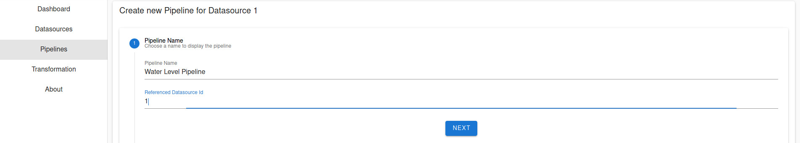

Step 2: In this step, you can manipulate the raw data to fit your needs by writing JavaScript code. The data object represents the incoming raw data. In this example, the attribute test is added to the data object before returning it.

Step 3: Describe additional meta-data for the pipeline.
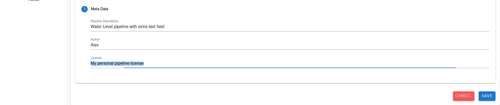

After clicking on the save button, you should see the recently created pipeline. 
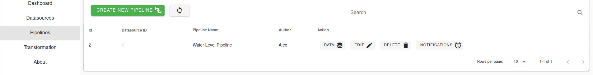

By clicking on the `Data` button inside the table you see the collected data by the pipeline.

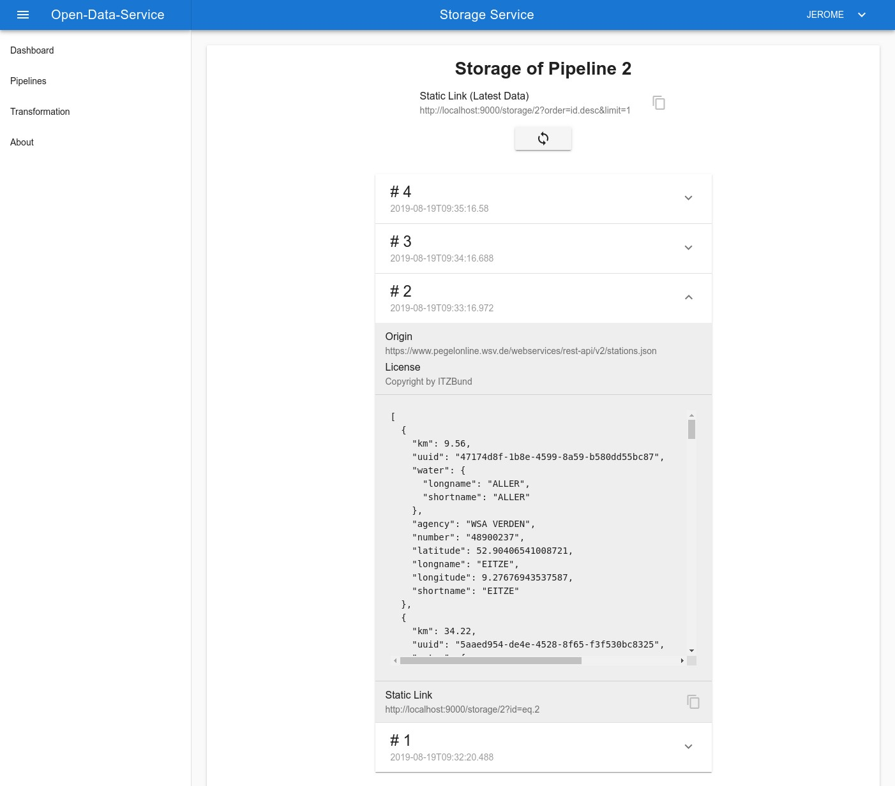

In this storage view, you see all data sets for the related pipeline. On top of this list, a static link shows the URL to fetch the data with a REST client.
Each data entry in the list can be expanded to see the fetched data and additional meta-data.

# Project Structure

We use the microservice architectural style in this project. The microservices are located in the sub-directories and communicate at runtime over network with each other. Each Microservice has its own defined interface that has to be used by other services, direct access to the database of other microservices is strictly prohibited. In production, each microservice can be multiplied in order to scale the system (except the scheduler at the moment).

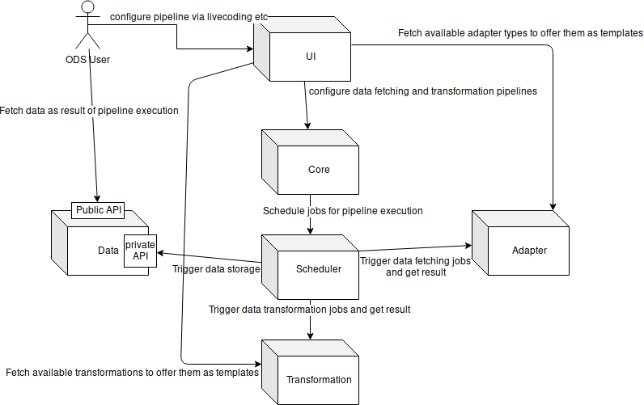

| Microservice | Description |
|----|----|
| [Web-Client / UI](ui/README.md) | easy and seamless configuration of Sources, Pipelines | 
| [Scheduler](scheduler/README.md) | orchestrates the executions of Pipelines |
| [Adapter-Service](adapter/README.md) | fetches data from Sources and imports them into the system |
| [Pipeline-Service](pipeline/README.md) | definition of pipelines, execution of data pipelines |
| [Notification-Service](notification/README.md) | execution of notifications |
| [Storage-Service](storage/README.md) | stores data of Pipelines and offers an API for querying |
| Reverse-Proxy | communication of UI with backend microservices independent from deployment environment |

Further information about a specific microservice can be found in the respective README file. 
Examples showing the API of each microservice are in the [example request](doc/example-requests) directory.

Instructions on how to analyse the microservice architecture with a service dependency graph in Neo4j, can be found [here](doc/service-dependency-graph.md).

# Deployment
Docker images of the microservices the ods consists of are deployed via our continous deployment pipeline. 

An online live instance is planned and will soon be available.

A detailled explanation of available deployment mechanisms is accessible in our [deployment section](deployment/README.md).

# Contributing

Contributions are welcome. Thank you if you want to contribute to the development of the ODS.
There are several ways of contributing to the ODS:
- by implementing new features
- by fixing known bugs
- by filing bug reports
- by improving the documentation
- by discussing use cases that are not covered yet

You can check our [issue board](https://github.com/jvalue/open-data-service/issues) for open issues to work on or to create new issues with a feature request, bug report, etc.
Before we can merge your contribution you need to accept your Contributor License Agreement (CLA), integrated into the Pull Request process.

Please provide your contribution in the form of a pull request. We will then check your pull request as soon as possible and give you feedback if necessary.
Please make sure that commits related to an issue (e.g. closing an issue) contains the issue number in the commit message.

# Contact us

If you have any questions or would like to contact us, you can easily reach us via [gitter channel](https://gitter.im/jvalue-ods/community). Issues can be reported via [GitHub](https://github.com/jvalue/open-data-service/issues).

# License

Copyright 2019-2020 Friedrich-Alexander Universität Erlangen-Nürnberg

This program is free software: you can redistribute it and/or modify it under the terms of the GNU Affero General Public License as published by the Free Software Foundation, either version 3 of the License, or (at your option) any later version.

This program is distributed in the hope that it will be useful, but WITHOUT ANY WARRANTY; without even the implied warranty of MERCHANTABILITY or FITNESS FOR A PARTICULAR PURPOSE. See the GNU Affero General Public License for more details.

You should have received a copy of the GNU Affero General Public License along with this program. If not, see http://www.gnu.org/licenses/.

SPDX-License-Identifier: AGPL-3.0-only
