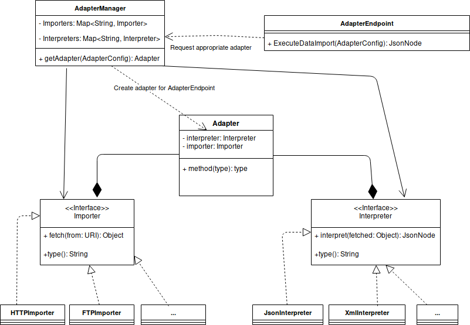

# Adapter Service of the ODS
The adapter service fetches data from external data sources and provides them via a HTTP API in JSON format. 
The data coming from the external sources can be fetched over various protocols and can have various formats.
## Current Features
* Currently the adapter service is only a prototype and can handle JSON, XML and CSV files that can be fetched over HTTP.
## Planned Features
The handling of new protocols and formats is going to be implemented. 

Planned protocols:
* ftp

Planned formats:

## Getting Started

* Build with `./gradlew build`
* Run unit tests with `./gradlew test`
* Run integration test with `./gradlew integrationTest` (note that a instance of the adapterService needs to be up).
* Start with `./gradlew bootRun`  - <b>not recommended</b>
* Use Docker-Compose: `docker-compose -f ../docker-compose.yml -f ../docker-compose.ci.yml up adapter-service` builds Docker images and starts them up. 
Note that you need to delete existing docker images from your local docker daemon to have recent changes integrated. 
* For integration testing run `docker-compose -f ../docker-compose.yml -f ../docker-compose.ci.yml up adapter-service adapter-service-it`

## Architecture
Each adapter consists of a importer that is responsible for the handling of the data source protocol and a interpreter that reformats the given data to json format.
The implemented importers and interpreters are stored in a map in the AdapterManager.
For each request to the AdapterEndpoint, the AdapterManager chooses a appropriate Interpreter and Importer and creates an Adapter to handle the request.
Information about data format, protocal and location of the external data source to include are stored in a AdapterConfig file which is included in the request.
The basic architecture of the ODS is depicted below. 
Support for new protocols or data formats can easily be achieved by adding classes implementing the importer/interpreter interface and registering those classes in the AdapterManager.



## API Docs

## Adapter API (data import)
| Endpoint  | Method  | Request Body  | Response Body |
|---|---|---|---|
| *base_url*/version  | GET  | -  | String containing the application version  |
| *base_url*/formats  | GET  | -  | JsonArray of data formats available for parsing and possible parameters |
| *base_url*/protocols  | GET  | -  | JsonArray of protocols available for importing and possible parameters  |
| *base_url*/dataImport  | POST  | AdapterConfig file  | ImportResponse |
| *base_url*/data/{id}  | GET  | -  | JSON representation of imported data with {id} |


When started via docker-compose *base_url* is `http://localhost:9000/api/adapter`

### Adapter Config
```
{
    "protocol": {
      "type": "HTTP",
      "parameters": {
        "location": String,
        "encoding": String
      }
    }
    "format": {
      "type": "JSON" | "XML" | "CSV"
      "parameters": { } | CSVParameters
    }
  }
  ```

### CSV Parameters
```
{
  "columnSeparator": char,
  "lineSeparator": char,
  "skipFirstDataRow": boolean,
  "firstRowAsHeader": boolean
}
```

### ImportResponse
```
{
    "id": string,
    "location": <<String containing the relative location of the data>>
}
```


## Datasource API (configs)
| Endpoint  | Method  | Request Body  | Response Body |
|---|---|---|---|
| *base_url*/datasources  | GET  | -  | All DatasourceConfigs  |
| *base_url*/datasources/{id}  | GET  | -  | DatasourceConfig wih {id}  |
| *base_url*/datasources  | POST  |  Datasource Config  | Created datasource, id generated by server |
| *base_url*/datasources/{id}  | PUT  | Datasource Config  | Updated datasource with {id}  |
| *base_url*/datasources  | DELETE  | -  | Delete all datasources  |
| *base_url*/datasources/{id}  | DELETE  | -  | Delete datasource with {id} |
| *base_url*/datasources/${id}/trigger  | POST  | Parameters  | Adapter ImportResponse |

When started via docker-compose *base_url* is `http://localhost:9000/api/adapter`

### Datasource Config
```
{
  "id": Number,
  "protocol": ProtocolConfig,
  "format": FormatConfig,
  "trigger": TriggerConfig,
  "metadata": Metadata
}
```

### Protocol Config
```
{
    "type": "HTTP",
    "parameters": {
      "location": String,
      "encoding": String
    }
}
```

### Format Config
```
{
  "format": {
    "type": "JSON" | "XML" | "CSV"
    "parameters": { } | CSVParameters
  }
}
```

### CSV Parameters
```
{
  "columnSeparator": char,
  "lineSeparator": char,
  "skipFirstDataRow": boolean,
  "firstRowAsHeader": boolean
}
```

### TriggerConfig
```
{
  "firstExecution": Date (format: yyyy-MM-dd'T'HH:mm:ss.SSSXXX),
  "interval": Number,
  "periodic:" Boolean
}
```

### Metadata 
```
{
  "author":String,
  "displayName":String,
  "license":String,
  "description":String
}
```

### Datasource Config Event (AMQP)
```
{
  "datasource": DatasourceConfig
}
```

### Parameters
```
{
  "parameters": <<Map of type <String, String> for open parameter to replace with the value>>
}
```
